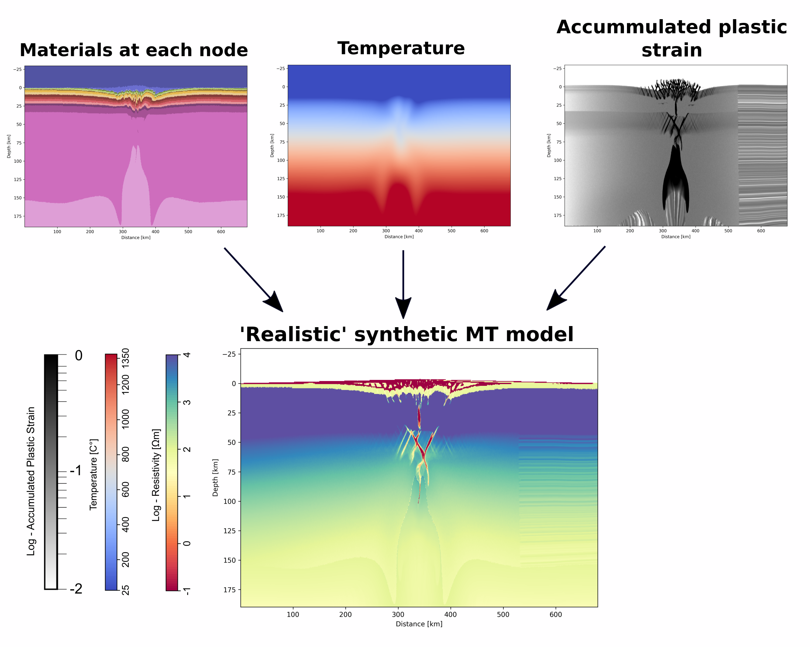

# Summary

`pide` is a Python library for calculating geophysical parameters (e.g., electrical conductivity, seismic velocity), employing the results from experimental petrology, mineral/rock physics, and thermomechanical modelling studies. `pide` can calculate the theoretical electrical conductivity of any earth material that exists in the literature. `pide` can also calculate seismic velocity utilising the external 'sister' library `SAnTex`. Using these theoretical calculations, users can utilise inversion modules to decode geophysical anomalies compositionally or convert thermomechanical models into geophysical observables. With a given spatial mapping of earth materials, which can preferentially be loaded from a thermomechanical model, `pide`  can be used to build synthetic electrical conductivity and seismic velocity models and generate gravity and magnetic anomalies. Moreover, `pide` is built as a modular tool, so users can easily build their functions.

# Statement of need
Given the inherent heterogeneity and complexity of Earth systems, geophysical tomographies often yield complex 2D and 3D images that are challenging to interpret. To enhance their interpretations, researchers commonly turn to experimental petrology and mineral physics, covering various geophysical properties, including electrical conductivity, magnetic susceptibility, seismic velocity, and rheology. These properties are sensitive to phase transitions, partial melting, major and trace elements partitioning, mineral solubilities, and phase-mixing models. Numerous specialized tools have been designed to address specific properties, many of which feature graphical interfaces [e.g.,MATE; @Ozaydin2020; @Abers2016] or are accessible through web-based applications like sigmelts [@Pommier2011].  In this context, `pide` is a solution fulfilling the need for a versatile library capable of facilitating petrophysical calculations across a range of properties and supporting the creation of specific scientific tools. Beyond this, `pide` aims to host toolkits tailored for specific purposes, such as constructing realistic, petrophysically constrained synthetic models and converting numerical plate tectonic models into synthetic geophysical tomographies.

# Library modules and methods

The general workflow diagram of the library can ben seen in Figure 1. The library has three main classes used in these calculations: `pide`, `material` and `model`. 

`pide` is the main class in which the electrical conductivity and seismic-related observables are calculated. In order to achieve this, the relevant parameters have to be defined in the `pide` object with the associated functions (e.g., composition, water content, interconnectivity). Just using the `pide` class, for instance, the user can make a figure of all calculations of all the olivine electrical conductivity and seismic velocity models for olivine. While experimental parameters for electrical conductivity parameters are defined and calculated within the `pide`, seismic velocities of given earth materials are calculated through `SAnTex` library automatically.

`material` is the class that can be specified as a holder of pre-defined material properties. For instance, one can create a Lherzolite material by mixing specific modal proportions of olivine (ol), orthopyroxene (opx), clinopyroxene (cpx) and garnet (gt), how these constituents are interconnected, or how water behaves among them. This class allows the user to define some parameters tied to other parameters via user-defined functions. This allows the users to streamline some specific processes in a modular manner.

The `model` class, on the other hand, is where a collection of `material` objects can be appended with specific positions indexed in 3D space.
`model` is also where the user can calculate the magnetic and gravitational anomalies solely since these observables are dependent on the position of the materials and assigned magnetic and density parameters only. `pide` can generate synthetic data for magnetic and gravitational anomalies utilising the `harmonica` library [@fatiando_a_terra_project_2024]. `pide` can generate synthetic electric conductivity and seismic velocity models that can be saved as input files for commonly used magnetotelluric modelling algorithms `ModEM` [@Kelbert2014] and `Mare2DEM` [@Key2016]. Users then can generate synthetic data using the algorithms provided by these software packages.

`pide` also comes with several modules that can exploit the library classes. 'model_modifier' functions. Utilising 'model_modifier' functions, `pide` can convert a thermomechanical model into a 'realistic' synthetic electrical conductivity model (Figure 2). Details of this conversion can be seen in the Notebook named `10_2D_Underworld_Conversion_II_Narrow_Rift.ipynb`. `inversion` modules, on the other hand, can be utilised to invert for specific input parameters (e.g., composition, mineral interconnection) that fit real geophysical data. 

# Acknowledgements
This study is supported by the Australian Research Council (ARC) Linkage Grant ARC-LP190100146 and ARC DP Grant ARC-DP220100709. 

# References
