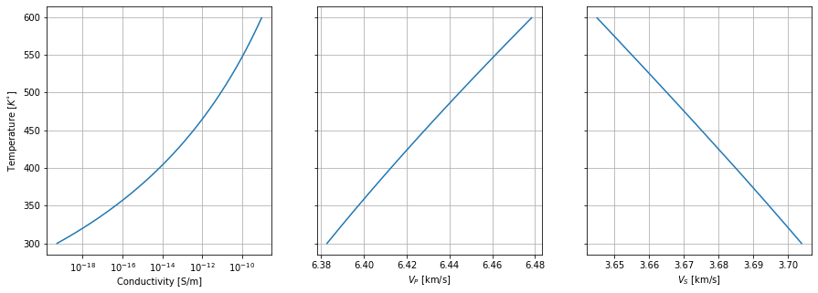

## <span style="color:green"> Notebook - Material Class </span>
<span style="color:purple">Sinan Ozaydin, School of Geosciences, The University of Sydney, NSW 2006, Australia <br/> </span>
<span style="color:purple">sinan.ozaydin@protonmail.com</span>


```python
import numpy as np
import matplotlib.pyplot as plt
```

    /home/sinan/.local/lib/python3.10/site-packages/matplotlib/projections/__init__.py:63: UserWarning: Unable to import Axes3D. This may be due to multiple versions of Matplotlib being installed (e.g. as a system package and as a pip package). As a result, the 3D projection is not available.
      warnings.warn("Unable to import Axes3D. This may be due to multiple versions of "


In this notebook, we will learn how to use the material class in pide library. 

Material is an object that can be constructed in *pide* that can be used to define a compositional environment. A user might want to define a material rather than defining the parameters on a *pide* object because they might want to streamline a calculation or append these materials into *model* class to use the other functionalities exist in pide, such as 3D model conversion. First, we have to import neccesary 


```python
from pide.material import Material
```

Let's define a material using a mineral matrix, a pyroxenite!


```python
Pyroxenite_Material = Material(name = 'Pyroxenite', calculation_type = 'mineral', composition = {'opx':0.6,'cpx':0.3,'ol':0.1},
el_cond_selections = {'opx':0,'cpx':0, 'ol':4}, solid_phase_mixing = 1)
```


```python
temp = np.arange(600,1300)
p = np.ones(len(temp)) * 3.0
cond_px = Pyroxenite_Material.calculate_conductivity(T = temp, P = p)
v_bulk_px, v_p_px, v_s_px = Pyroxenite_Material.calculate_seismic_velocity(T = temp, P = p)

fig = plt.figure(figsize = (15,5))
ax1 = plt.subplot(131)
ax2 = plt.subplot(132)
ax3 = plt.subplot(133)

ax1.plot(cond_px,temp)
ax2.plot(v_p_px,temp)
ax3.plot(v_s_px,temp)

ax1.set_xscale('log')

ax1.set_ylabel('Temperature [$K^{\circ}$]')
ax1.set_xlabel('Conductivity [S/m]')
ax2.set_xlabel('$V_P$ [km/s]')
ax3.set_xlabel('$V_S$ [km/s]')

ax1.grid(which = 'major')
ax2.grid(which = 'both')
ax3.grid(which = 'both')

ax2.set_yticklabels([])
ax3.set_yticklabels([])
plt.show()
```


    

    


Now, let's define a material with 'rock' method, a granite.


```python
Granite_Material = Material(name = 'Granite', calculation_type = 'rock', composition = {'granite':1.0},
							   el_cond_selections = {'granite': 10},solid_phase_mixing_idx = 1)
```

Here, we defined the 'Granite_Material' where the electrical conductivity calculation will be carried out as 'rock' method, completely made out of granite, use electrical conductivity selection as the 10th index, use Hashin-Shtrikman Lower Bound to calculate the mixture. Using this material, now let's calculate electrical conductivity and seismic velocities at the given temperature and pressure.


```python
temp2 = np.arange(300,600)
p2 = np.ones(len(temp2)) * 0.5
cond = Granite_Material.calculate_conductivity(T = temp2, P = p2)
v_bulk, v_p, v_s = Granite_Material.calculate_seismic_velocity(T = temp2, P = p2)

fig = plt.figure(figsize = (15,5))
ax1 = plt.subplot(131)
ax2 = plt.subplot(132)
ax3 = plt.subplot(133)

ax1.plot(cond,temp2)
ax2.plot(v_p,temp2)
ax3.plot(v_s,temp2)

ax1.set_xscale('log')

ax1.set_ylabel('Temperature [$K^{\circ}$]')
ax1.set_xlabel('Conductivity [S/m]')
ax2.set_xlabel('$V_P$ [km/s]')
ax3.set_xlabel('$V_S$ [km/s]')

ax1.grid(which = 'major')
ax2.grid(which = 'both')
ax3.grid(which = 'both')

ax2.set_yticklabels([])
ax3.set_yticklabels([])
plt.show()
```


    

    


As One can see an unlikely inverse relationship is there between $V_P$ and temperature. This is due to rare negative thermal expansion coefficients observed in beta-quartz. On the other hand, the electrical conductivity of granite at these temperatures are quite low. This is the general behaviour of silicate rocks who behave as a semi-conductor.

Attributes of a material object can also be copied into another material object. Now, let's try to copy the Pyroxenite object into another object called Pyroxenite_Material_2.


```python
temp = np.arange(600,1300)
p = np.ones(len(temp)) * 3.0
#First create the empty object.
Pyroxenite_Material_2 = Material()
#Now we can copy the attributes using copy_attributes method
Pyroxenite_Material.copy_attributes(Pyroxenite_Material_2)
#Now, let's change the copied materials name and el_cond_method:
Pyroxenite_Material_2.name = 'Pyroxenite_Material_2'
Pyroxenite_Material_2.el_cond_selections = {'opx':5,'cpx':0, 'ol':1}

#Now, let's calculate the same conductivities and plot them!
cond_px_2 = Pyroxenite_Material_2.calculate_conductivity(T = temp, P = p)
v_bulk_px_2, v_p_px_2, v_s_px_2 = Pyroxenite_Material_2.calculate_seismic_velocity(T = temp, P = p)

fig = plt.figure(figsize = (15,5))
ax1 = plt.subplot(131)
ax2 = plt.subplot(132)
ax3 = plt.subplot(133)

ax1.plot(cond_px,temp)
ax1.plot(cond_px_2,temp,linestyle = '--')
ax2.plot(v_p_px,temp)
ax2.plot(v_p_px_2,temp,linestyle = '--')
ax3.plot(v_s_px,temp)
ax3.plot(v_s_px_2,temp,linestyle = '--')

ax1.set_xscale('log')

ax1.set_ylabel('Temperature [$K^{\circ}$]')
ax1.set_xlabel('Conductivity [S/m]')
ax2.set_xlabel('$V_P$ [km/s]')
ax3.set_xlabel('$V_S$ [km/s]')

ax1.grid(which = 'major')
ax2.grid(which = 'both')
ax3.grid(which = 'both')

ax2.set_yticklabels([])
ax3.set_yticklabels([])
plt.show()
```


    

    


